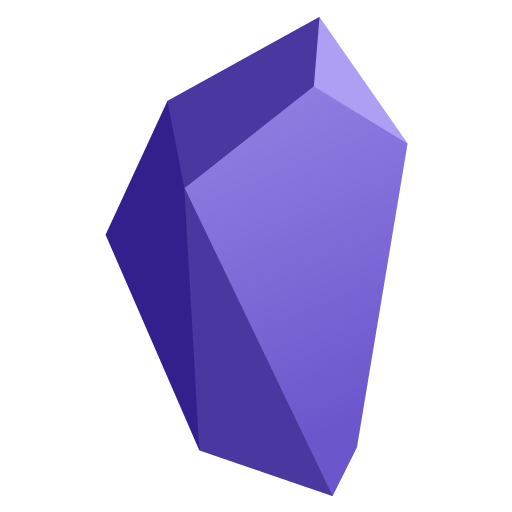

# Un título principal
## Un subtítulo
**Un párrafo, con palabras en negrita**, *en cursiva*, en código
para ello he utilizado una barra baja con dos asteriscos en cada lado, de esta `forma puedo ponerlo en negrita y en cursiva.`
Un trozo de código
```

def lista_juegos():
    URL_BASE="https://api.rawg.io/api/"
    key=os.environ["exportkey"]
    #Lo hago con datetime porque la librería os.system no guarda en una variable la fecha.
    texto=request.form.get("texto")
    print ('texto=',texto)
    texto2=request.form.get("texto2")
    print ('Texto2=',texto2)
    texto3=request.form.get("texto3")
    print('Texto3=',texto3)
```
1. Una lista ordenada
2. Segunda lista ordenada
3.  Tercera lista ordenada

- Una lista desordenada.
- Otra lista desordenada.

Un enlace a una URL externa.

[Mi github](https://www.github.com/evanticks)

Un enlace a otro fichero Markdown que tengas en el repositorio.

[Otro fichero Markdown como es el Readme.md](https://github.com/Evanticks/prueba_Antonio_Marchan/blob/main/README.md)

Una imagen



Una tabla

| personaje | | |
| ----- | -----| ----- |
| **codpersonaje** | varchar2 (9) | que empiece por 1
| nombre | varchar2 (15) | Que empiece por mayúsculas y no lleve números. |
| altura | number (3,2) |
| peso | number (3) |
| raza | varchar2 (10) | "Humano" por defecto

